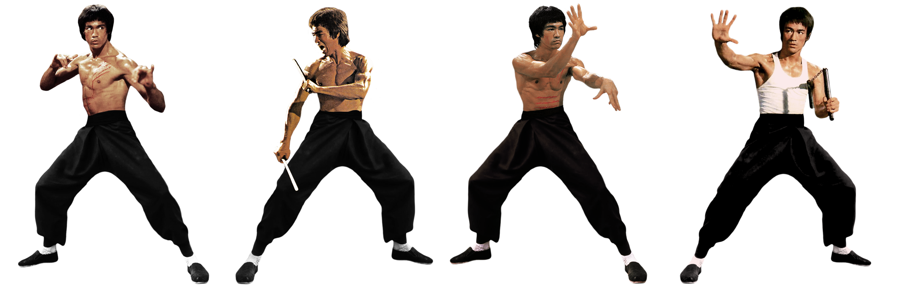
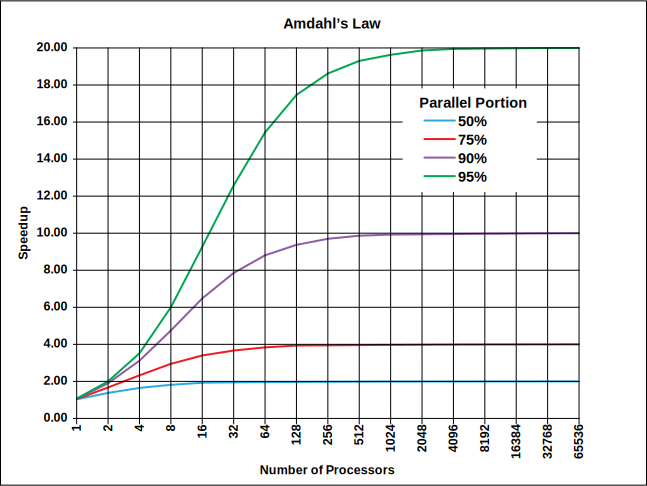
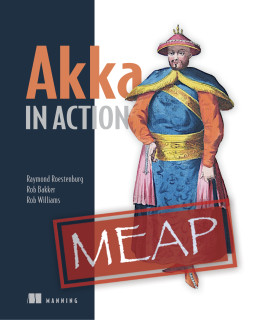
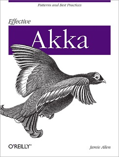
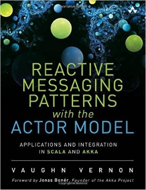

- title : Actor-based concurrency with Akka.NET 
- description : Actor-based concurrency with Akka.NET. Denver Dev Day (October 23, 2015)
- author : Grigoriy Belenkiy
- theme : simple
- transition : zoom

***

### Actor-based concurrency with Akka.NET



<!-- Image by sachso74 (DevianTArt) -->

<small>Grigoriy Belenkiy<br/>
Software engineer, McGraw Hill Financial<br/>
[@grishace](https://twitter.com/grishace)<br/>
<br/>
Denver Dev Day<br/>
October 23, 2015</small>

***

### Agenda

- Actor Model
- Akka.NET
- Demo

***

### The free lunch is over!

<ul>
<span class="fragment"><li>Moore's law is no longer in effect</li></span>
<span class="fragment"><li>The new reality: Amdahl’s law</li></span>
</ul>

' Free lunch is over - 2005 - Dr. Dobb's magazine
' Moore's law - 1965- transistor doubles every 18 months (and speed)
' Amdahl’s law - 1967 - max speedup from parallel execution ~20%

---



 
***

### 10 years later...

<ul>
<span class="fragment"><li>Still hard to write <span class="fragment dn">correct</span> concurrent applications</li></span>
<span class="fragment"><li>Shared <span class="fragment dn">mutable</span> state</li></span>
<span class="fragment"><li>Isolation + Immutability</li></span>
</ul>

' threads - deadlocks, race conditions
' async/await + TPL
' 

***

### Actor Model

>The actor model in computer science is a mathematical model of concurrent computation that treats "actors" as the universal primitives of concurrent computation: in response to a message that it receives, an actor can make local decisions, create more actors, send more messages, and determine how to respond to the next message received.

Carl Hewitt (1973), [Wikipedia](https://en.wikipedia.org/wiki/Actor_model)

---

### Actor Model

- Erlang (first version - 1986, famous AXD301 switch - 1998)
- Part of Scala (2006)

---

[](http://akka.io/)<br/>
Akka ([Typesafe, Inc.](https://www.typesafe.com/), 2010)

' mountain in Sweden

---

[](http://getakka.net/)<br/>
Akka.NET ([Petabridge](https://www.typesafe.com/), 2014-2015)

***

### Actor


***

### Hello, World!

```csharp
      ActorSystem actorSystem;
      using (actorSystem = ActorSystem.Create("HelloWorld"))
      {
        var helloWorldActor =
          actorSystem.ActorOf(Props.Create(() => new HelloWorldActor()));
        helloWorldActor.Tell(new HelloWorldMessage("Hello, World!"));
      }
      actorSystem.AwaitTermination();
```

***

### Supervision


---

### One-For-One Strategy


---

### All-For-One Strategy


***

### Demo

[https://github.com/grishace/ddd-akka/tree/master/code](https://github.com/grishace/ddd-akka/tree/master/code)

***

### Other implementations

- Orleans<br/>[https://github.com/dotnet/orleans](https://github.com/dotnet/orleans)<br/>
- PostSharp<br/>[http://doc.postsharp.net/actor](https://github.com/dotnet/orleans)<br/><small>commercial product, only 10 classes per project in free version</small><br/>
- F# MailboxProcessor<br/>[MSDN](https://msdn.microsoft.com/en-us/library/ee370357.aspx?f=255&MSPPError=-2147217396)<br/><small>included into FSharp.Core</small>

***

### Resources

- JVM Akka [http://akka.io](http://akka.io)
- Akka.NET [http://getakka.net](http://httpgetakka.net)
- Akka.NET Bootcamp [https://petabridge.com/bootcamp/](https://petabridge.com/bootcamp/)

---

### Books

<table id="books-table"><tr>
<td width="33%"><a href="https://www.manning.com/books/akka-in-action" title="Akka in Action"></a></td>
<td width="33%"><a href="http://shop.oreilly.com/product/0636920028789.do" title="Effective Akka"></a></td>
<td width="34%"><a href="http://www.amazon.com/Reactive-Messaging-Patterns-Actor-Model/dp/0133846830/" title="Reactive Messaging Patterns with the Actor Model: Applications and Integration in Scala and Akka"></a></td>
</tr>
<tr><td>
<small><h3>Akka in Action</h3>
<h4>by Raymond Roestenburg, Rob Bakker, and Rob Williams</h4></small></td>
<td><small><h3>Effective Akka</h3>
<h4>by Jamie Allen</h4></small></td>
<td><small><h3>Reactive Messaging<br/>Patterns with the Actor Model</h3>
<h4>by Vaughn Vernon</h4></small></td>
</tr></table>

***

[](https://github.com/grishace/ddd-akka)<br/>
[https://github.com/grishace/ddd-akka](https://github.com/grishace/ddd-akka)
