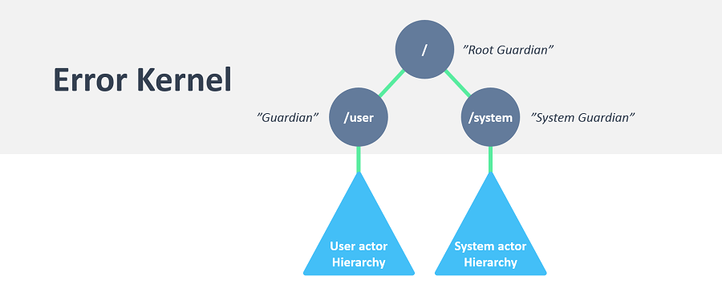

- title : Actor-based concurrency with Akka.NET 
- description : Actor-based concurrency with Akka.NET. Golden Func Meetup (January 14, 2016)
- author : Grigoriy Belenkiy
- theme : simple
- transition : zoom

***

### Actor-based concurrency with Akka.NET


<!-- Image by sachso74 (DevianTArt) -->

<small>Grigoriy Belenkiy<br/>
Software engineer, McGraw Hill Financial<br/>
[@grishace](https://twitter.com/grishace)<br/>
<br/>
Golden Func Meetup<br/>
January 14, 2016</small>

***

### Agenda

- Actor Model
- Akka.NET
- Demo

***

### The free lunch is over!

<ul>
<span class="fragment"><li>Moore's law is no longer in effect</li></span>
<span class="fragment"><li>The new reality: Amdahl’s law</li></span>
</ul>

' Free lunch is over - 2005 - Dr. Dobb's magazine
' Moore's law - 1965- transistor doubles every 18 months (and speed) Gordon Moore - founder of Intel
' Amdahl’s law - 1967 - max speedup from parallel execution ~20% Gene Amdahl - computer architect

---


 
***

### 10 years later...

<ul>
<span class="fragment"><li>Still hard to write <span class="fragment dn">correct</span> concurrent applications</li></span>
<span class="fragment"><li>Shared <span class="fragment dn">mutable</span> state</li></span>
<span class="fragment"><li>Isolation + Immutability</li></span>
</ul>

' threads - deadlocks, race conditions
' async/await + TPL
' 

***

### Actor Model

>The actor model in computer science is a mathematical model of concurrent computation that treats "actors" as the universal primitives of concurrent computation: in response to a message that it receives, an actor can make local decisions, create more actors, send more messages, and determine how to respond to the next message received.

Carl Hewitt (1973), [Wikipedia](https://en.wikipedia.org/wiki/Actor_model)

' Computer scientist
' Extreme encapsulation (Martin Odersky)

---

### Actor Model

- Erlang (first version - 1986, famous AXD301 switch - 1998)
- Part of Scala (2006)

---

[](http://akka.io/)<br/>
Akka ([Typesafe, Inc.](https://www.typesafe.com/), 2010)

' mountain in Sweden

---

[](http://getakka.net/)<br/>
Akka.NET ([Petabridge, LLC](https://www.typesafe.com/), 2014-2015)

---

### Actor Model

<p style="text-align:justify">
In the Actor model, everything is an actor. Just like how everything is an "object" in Object Oriented Programming (OOP.) When working in C#, you have to model your problem domain using classes and objects. When working with Akka.NET, you model your problem domain with actors and messages.
</p>

***

### Actor


' Image by Petabridge
' Async messages
' ActorRef - location transparency
' System messages (such as child failure) has highest priority (i.e. bypasses message ordering)

---

### Actor Address


' Image by Petabridge

***

### Hello, World!

```fsharp
let helloWorld () = 
  let system = System.create "helloworld-system" (Configuration.load())
  let actor = spawn system "helloworld-actor" (actorOf (fun m -> printfn "%s" m))
  actor <! "Hello, World!"
```

***

### Supervision



' Image by Petabridge
' Restart (default), Stop, Escalate, Resume
' Point - localizing failure, push potentially dangerous operation to a child

---

### Supervision Strategies

<table class="no-borders-table">
<tr><td width="50%">One-For-One Strategy</td><td width="50%">All-For-One Strategy</td></tr>
<tr>
<td></td>
<td></td>
</tr>
</table>

' Images by Petabridge

***

### Demo

[https://github.com/grishace/ddd-akka/tree/fsharp/code/FSharp](https://github.com/grishace/ddd-akka/tree/fsharp/code/FSharp)

***

### Akka.NET Goes to Wall Street

>With two people, and me doing 80% of the work, we were able to completely rewrite the XHR/Web API layer into SignalR/Akka inside of 4 weeks.

<!-- -->

>I couldn't be happier with Akka overall.

<small>Joel Mueller, Software Architect, SNL Financial<br/><a href="https://petabridge.com/blog/akkadotnet-goes-to-wall-street/">https://petabridge.com/blog/akkadotnet-goes-to-wall-street/</a></small>

***

### Other implementations

- Orleans<br/>[https://github.com/dotnet/orleans](https://github.com/dotnet/orleans)<br/><small>Achtung! Different language!</small>
- PostSharp<br/>[http://doc.postsharp.net/actor](https://github.com/dotnet/orleans)<br/><small>commercial product, only 10 classes per project in free version</small><br/>
- F# MailboxProcessor<br/>[MSDN](https://msdn.microsoft.com/en-us/library/ee370357.aspx?f=255&MSPPError=-2147217396)<br/><small>included into FSharp.Core</small>

***

### Resources

- JVM Akka [http://akka.io](http://akka.io)
- Akka.NET [http://getakka.net](http://httpgetakka.net)
- Akka.NET Bootcamp [https://petabridge.com/bootcamp/](https://petabridge.com/bootcamp/)

' Princeples of Reactive Programming (Coursera)

---

### Books

<table class="no-borders-table"><tr>
<td width="33%"><a href="https://www.manning.com/books/akka-in-action" title="Akka in Action"></a></td>
<td width="33%"><a href="http://shop.oreilly.com/product/0636920028789.do" title="Effective Akka"></a></td>
<td width="34%"><a href="http://www.amazon.com/Reactive-Messaging-Patterns-Actor-Model/dp/0133846830/" title="Reactive Messaging Patterns with the Actor Model: Applications and Integration in Scala and Akka"></a></td>
</tr>
<tr><td>
<small><h3>Akka in Action</h3>
<h4>by Raymond Roestenburg, Rob Bakker, and Rob Williams</h4></small></td>
<td><small><h3>Effective Akka</h3>
<h4>by Jamie Allen</h4></small></td>
<td><small><h3>Reactive Messaging<br/>Patterns with the Actor Model</h3>
<h4>by Vaughn Vernon</h4></small></td>
</tr></table>

***

[](https://github.com/grishace/ddd-akka)<br/>
[https://github.com/grishace/ddd-akka](https://github.com/grishace/ddd-akka)
